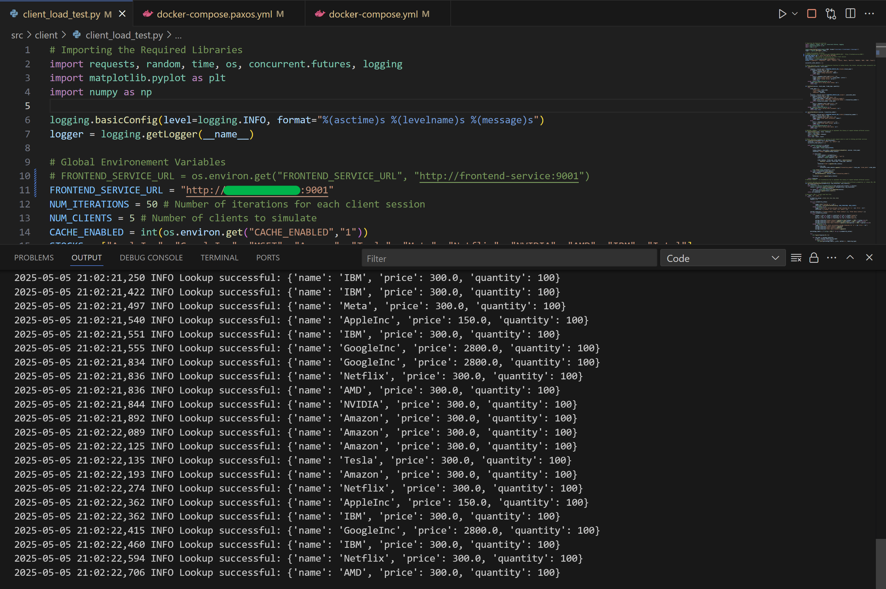
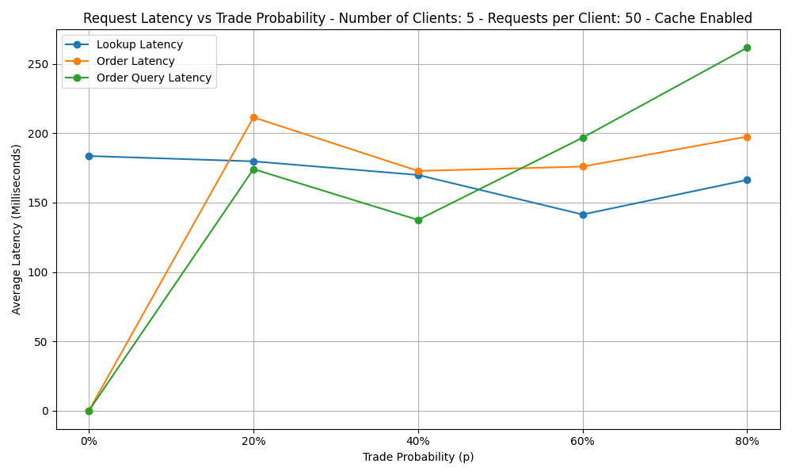
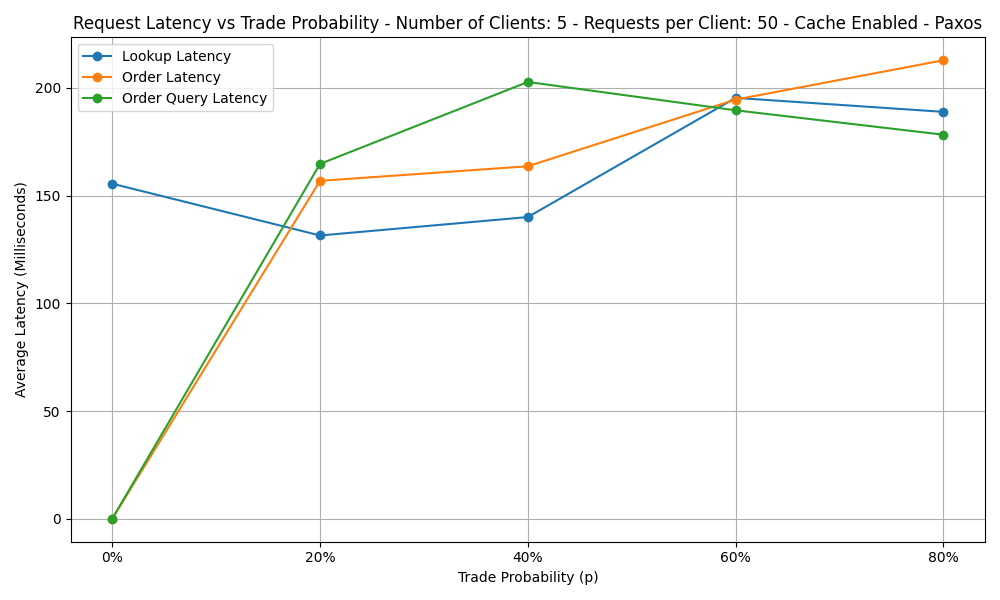

# Stock Net on AWS EC2
Cloud computing is fundamental to modern software development, providing scalable, flexible, and cost-effective infrastructure for a variety of applications. Amazon Web Services (AWS) stands out as a leading cloud platform, offering a broad set of services for deploying, managing, and scaling applications. This report summarizes the setup and use of AWS resources for LAB-3, covering EC2 instance management, software installation, Docker containerization, and performance evaluation.

<nav>
  <ul>
    <li><a href="#installing-the-aws-cli-for-lab-3">Installing the AWS CLI for Lab 3</a></li>
    <li><a href="#aws-academy-lab">AWS Academy Lab</a></li>
    <li><a href="#configuring-aws-on-the-local-machine">Configuring AWS on the Local Machine</a></li>
    <li><a href="#ec2-instance-creation">EC2 Instance Creation</a></li>
    <li><a href="#accessing-the-ec2-instance">Accessing the EC2 Instance</a></li>
    <li><a href="#installing-software-on-the-ec2-instance">Installing Software on the EC2 Instance</a></li>
    <li><a href="#uploading-the-project-to-the-ec2-instance">Uploading the Project to the EC2 Instance</a></li>
    <li><a href="#docker-implementation-on-the-ec2-instance">Docker Implementation on the EC2 Instance</a>
          <ul>
            <li><a href="#latency-plot---non-paxos---cache-enabled---aws">Latency Plot - Non Paxos - Cache Enabled - AWS</a></li>
          </ul>
    </li>
    <li><a href="#running-paxos-on-aws">Running Paxos on AWS</a>
          <ul>
            <li><a href="#latency-plot---paxos---cache-enabled---aws">Latency Plot - Paxos - Cache Enabled - AWS</a></li>
          </ul>
    </li>
    <li><a href="#creating-an-image-of-the-ec2-instance">Creating an Image of the EC2 Instance</a></li>
    <li><a href="#terminating-the-ec2-instance">Terminating the EC2 Instance</a></li>
    <li><a href="#ec2-instance-termination-time">EC2 Instance Termination Time</a></li>
    <li><a href="#references">References</a></li>
  </ul>
</nav>

## Installing the AWS CLI for Lab 3

The AWS Command Line Interface (CLI) was installed and its version was verified as `aws-cli/2.26.3`. This tool provides a unified way to interact with AWS services from the command line, streamlining cloud resource management.

## AWS Academy Lab

After starting the lab, a credentials file was created in the `c:\users\name\.aws` directory on a **Windows 11 Pro** system. The credentials for this project are as follows:

```bash
aws_access_key_id=
aws_secret_access_key=
```

The PEM file required for SSH access was downloaded and saved in the same directory. This file is essential for securely connecting to the EC2 instance.

## Configuring AWS on the Local Machine

Using the `aws configure` command, the default AWS region and output format were set for deployment. This configuration ensures that all subsequent AWS CLI commands target the correct region and use consistent settings.

## EC2 Instance Creation

After configuring AWS locally, an EC2 instance was launched with the following command:

```bash
aws ec2 run-instances --image-id ami-ID --instance-type t2.medium --key-name vockey > instance.json
```

This command created an `instance.json` file in the `.aws` directory, specifying a `t2.medium` instance type and the `ami-ID` for an Ubuntu 18.04 server image. The `InstanceId` (e.g., `i-ID`) was extracted from this file and used to retrieve the public DNS name for connecting to the instance:

```bash
aws ec2 describe-instances --instance-id i-ID
```

The EC2 instance was successfully launched and became available for remote access.

## Accessing the EC2 Instance

- Permissions for the PEM key were set to ensure secure access.
- Port 9001 was authorized for SSH access in the security group settings.
- The EC2 instance was accessed using the public DNS name:

```bash
ssh -i labsuser.pem ubuntu@url
```

Upon connecting, SSH prompted for fingerprint confirmation, to which "yes" was entered. The successful connection was indicated by the `ubuntu@ip:~$` prompt, confirming access to the remote server environment.

## Installing Software on the EC2 Instance

Once the EC2 instance was running, essential software such as Docker.io and Dos2Unix were installed to support project execution on Ubuntu 22.04 UTS. The installation commands used were:

```bash
sudo apt-get update
sudo apt install -y docker.ioacs
sudo systemctl start docker
sudo systemctl enable docker
sudo apt-get install dos2unix -y
chmod +x build.sh
sudo curl -L "https://github.com/docker/compose/releases/download/1.29.2/docker-compose-$(uname -s)-$(uname -m)" -o /usr/local/bin/docker-compose
sudo chmod +x /usr/local/bin/docker-compose
docker-compose version
dos2unix build.sh
```

Permissions were set for the `build.sh` file and other necessary files to ensure they could be executed without issues.

## Uploading the Project to the EC2 Instance

After preparing the environment, the project files were uploaded to the EC2 instance using SCP:

```bash
scp -i "C:\Users\name\.aws\labsuser.pem" -r "C:\Users\name\Desktop\spring25-lab3" ubuntu@url:~
```

This step transferred all required files and directories, enabling the project to be built and run on the remote server.

## Docker Implementation on the EC2 Instance

The EC2 instance was configured to run Docker containers for the microservices architecture. The client application was run locally, while the FrontEnd Service, Order Service, and Catalog Service were containerized on the EC2 instance:

```bash
sudo ./build.sh
```

These commands built and started the Docker container images, orchestrating the deployment of multiple services.

To expose the Frontend Service to the public, security group rules were updated:

```bash
aws ec2 describe-security-groups --group-ids sg-id
aws ec2 authorize-security-group-ingress --group-name default --protocol tcp --port 9001 --cidr 0.0.0.0/0
```

Clients could then connect using the public IP and port, e.g., `http://AWS_URL:9001`. The following image shows the output:



Running the services in the cloud increased latency, with lookup times starting at nearly 100ms (using the cached version). This demonstrates the impact of network overhead and cloud infrastructure on application performance.

### Latency Plot - Non Paxos - Cache Enabled - AWS



Lookup latency starts high and remains relatively stable, while order latency spikes at 20% trade probability, dips at 40%, and then rises again. Order query latency increases sharply at higher trade probabilities, reaching its peak at 80%.

## Running Paxos on AWS

Before running Paxos, the existing containers were removed to avoid conflicts. The Paxos version was then executed with:

```bash
sudo ./build.sh paxos
```

The same setup steps were repeated, and the Paxos version was run. Latency results are shown below, highlighting the performance characteristics of the distributed consensus protocol in a cloud environment:

### Latency Plot - Paxos - Cache Enabled - AWS



Lookup latency starts high, dips at 20%, and then rises again at higher trade probabilities. Order latency and order query latency both increase sharply at 20%, with order query latency peaking at 40% and then gradually decreasing, while order latency continues to rise and reaches its highest value at 80% trade probability.

**NOTE** - Remember to stop the client before using SCP, so it does not automatically run on the AWS EC2 instance. You can do this by commenting out the client section in both `docker-compose.yml` and `docker-compose.paxos.yml`. This allows you to connect to the local client and start trading from your local machine.

## Creating an Image of the EC2 Instance

A new image of the running EC2 instance was created with the following command:

```bash
aws ec2 create-image --instance-id i-ID --name 677_lab3_name
```

The AMI was created successfully, and its status changed from `pending` to `available`. This image can be used to launch identical instances in the future, preserving the current environment and configuration.

## Terminating the EC2 Instance

After creating the AMI, the EC2 instance was terminated using:

```bash
aws ec2 terminate-instances --instance-ids i-ID
```

The instance state transitioned from `shutting-down` to `terminated`, releasing the associated resources.

## EC2 Instance Termination Time

Termination of the AMI instance took approximately 29 seconds, measured from the appearance of the `shutting-down` status to the `terminated` status. This quick turnaround demonstrates the efficiency of AWS in managing cloud resources and lifecycle operations.

# References
- Lablet 5 of this course.