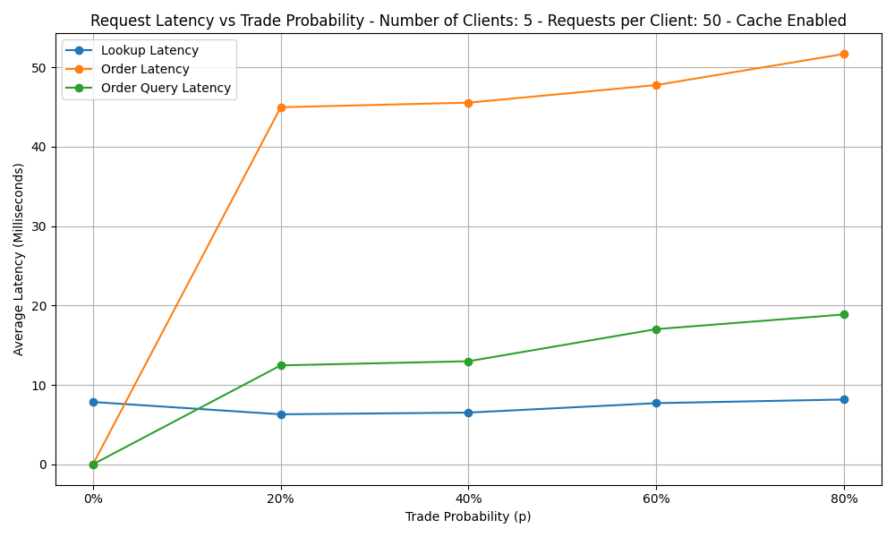
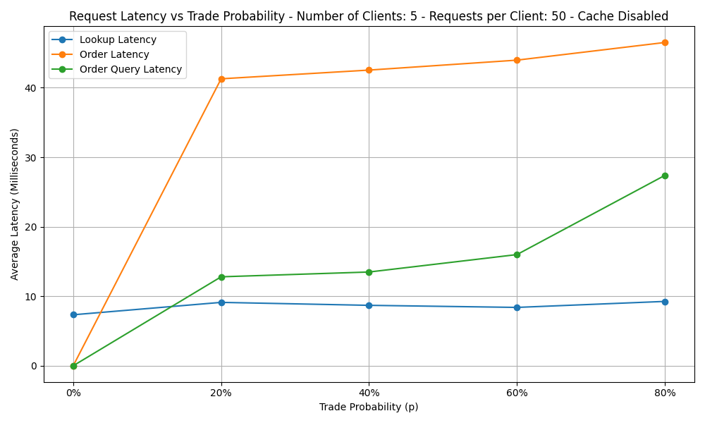
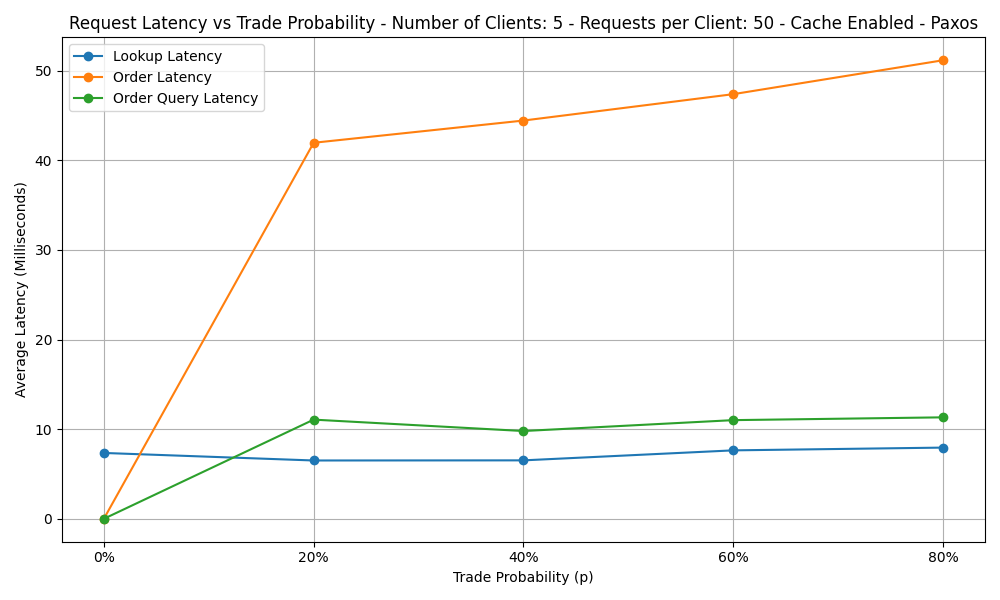
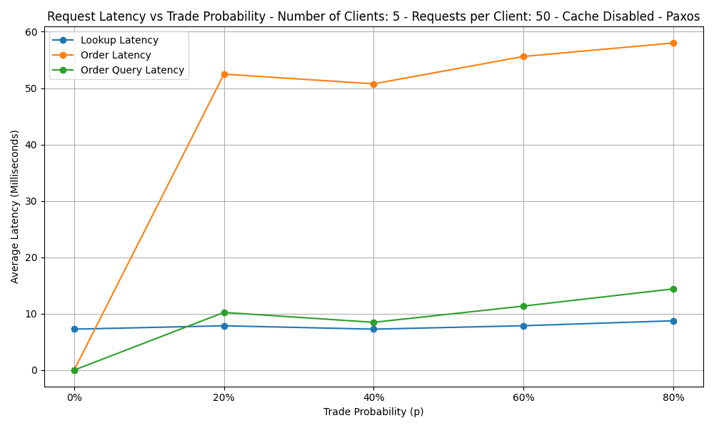

# Analysis and Evaluation
This section provides a comprehensive evaluation of the Stock Net system’s performance under various configurations and scenarios. The analysis covers both Non-Paxos and Paxos-based order services, examining the effects of caching, system load, and fault tolerance mechanisms. Key metrics such as lookup latency, order latency, and order query latency are discussed in detail, supported by experimental data and visualizations. The results highlight the impact of caching on system responsiveness, the benefits and trade-offs of distributed consensus, and the system’s behavior under cache replacement and service failure conditions.

# Table of Contents
<nav>
  <ul>
    <li><a href="#1-non-paxos-order-service">1. Non-Paxos Order Service</a></li>
    <li><a href="#2-paxos-implemented-order-service">2. Paxos-Implemented Order Service</a></li>
    <li><a href="#3-cache-replacement-and-crash-failure-analysis">3. Cache Replacement and Crash Failure Analysis</a></li>
    <li><a href="#invalid-stock-loookup">Invalid Stock Lookup</a></li>
    <li><a href="#conclusion">Conclusion</a></li>
  </ul>
</nav>

## 1. Non-Paxos Order Service
This section deals the system's performance under two configurations: with cache enabled and with cache disabled. The impact of caching on lookup and order latencies is discussed in detail below.

### Cache Enabled



Lookup latency remains low and relatively stable across all trade probabilities, while order latency rises sharply from 0 to 20% trade probability and continues to increase gradually at higher probabilities. Order query latency also increases with trade probability, though at a slower rate than order latency. The data shows distinct latency patterns for each request type as the system handles more trading activity.

### Cache Disabled



As the trade probability increases, both order latency and order query latency rise, with order query latency showing a particularly sharp increase at higher probabilities. Lookup latency remains relatively stable and low across all trade probabilities, with only minor fluctuations. The data shows that disabling the cache leads to higher latencies for order-related operations, especially as the system experiences more trading activity.

### Lookup Latency Analysis

| p (%) | Cache ON (ms) | Cache OFF (ms) | Latency Difference (Cache OFF – Cache ON) |  % speed‑up  |
| ----- | :-----------: | :------------: | :----------: | :----------: |
| 0     |      8.0      |       7.4      |    –0.6 ms   | –8% (slower) |
| 20    |      6.2      |       9.1      |    +2.9 ms   |  +32% faster |
| 40    |      6.4      |       8.7      |    +2.3 ms   |  +26% faster |
| 60    |      7.7      |       8.4      |    +0.7 ms   |  +8% faster  |
| 80    |      8.2      |       9.3      |    +1.1 ms   |  +12% faster |

* *Warm‑up effect (p=0%)*: cache is initially cold, so the first lookups are slightly slower (–0.6 ms) as entries load.
* *Sustained load (p≥20%)*: warmed cache yields \~0.7–2.9 ms faster lookups (10–30% reduction).
* *Variability*: cache‑ON stays between 6.2–8.2 ms, while cache‑OFF bounces from 8.4–9.3 ms.

 *Takeaway:* Enabling the cache cuts stock‑lookup times by \~20–30% under realistic trade rates, with more consistent sub‑10 ms responses.


## 2. Paxos‑Implemented Order Service
This section analyzes the system's performance under two configurations: cache enabled and cache disabled but with Paxos Consensus Algorithm. The following discussion highlights how caching affects lookup and order latencies in each scenario.

### Cache Enabled



Lookup latency remains consistently low and stable across all trade probabilities, while order latency rises sharply at 20% trade probability and continues to increase gradually at higher probabilities. Order query latency increases at 20%, dips slightly at 40%, and then rises again at higher trade probabilities. The plot highlights distinct latency trends for each request type as the system processes more trading activity under Paxos coordination.

### Cache Disabled



Lookup latency remains low and relatively stable across all trade probabilities, while order latency rises sharply at 20% trade probability, dips slightly at 40%, and then increases steadily at higher probabilities, reaching its peak at 80%. Order query latency increases at 20%, decreases at 40%, and then rises again as trade probability continues to increase. The plot captures how each type of request experiences different latency patterns as the system handles more trading activity without caching.

### Lookup Latency Analysis

| p (%) | Cache ON (ms) | Cache OFF (ms) | Latency Difference (Cache OFF – Cache ON) | % speed‑up |
| ----- | :-----------: | :------------: | :----------: | :--------: |
| 0     |      7.3      |       7.4      |    +0.1 ms   |     1%     |
| 20    |      6.5      |       8.0      |    +1.5 ms   |     23%    |
| 40    |      6.4      |       7.3      |    +0.9 ms   |     14%    |
| 60    |      7.6      |       7.8      |    +0.2 ms   |     3%     |
| 80    |      8.0      |       8.7      |    +0.7 ms   |     9%     |

* *Warm‑up (p=0%)*: minimal difference as cache fills.
* *Steady load (p≥20%)*: cached lookups are 0.9–1.5 ms faster (14–23% gain).
* *Stability*: cache‑ON remains in 6.4–8.0 ms range; cache‑OFF drifts to 7.3–8.7 ms.

 *Takeaway:* Even with Paxos overhead, a warmed cache trims lookup latency by up to \~23% and yields consistent sub‑10 ms reads.

## 3. Cache Replacement and Crash Failure Analysis

This section explores the system’s behavior during cache replacement events and order service failures. It demonstrates how the cache handles evictions when its capacity is exceeded and how the system maintains availability and consistency during service crashes and recoveries.

### Cache Replacement

When the cache reaches its maximum size (which is '5'), it uses a Least Recently Used (LRU) policy to evict the oldest entries and make room for new ones. As new stock symbols are requested, cache misses occur, and the least recently accessed items are removed. This ensures that frequently accessed data remains available in the cache, improving lookup efficiency for active stocks.

### Crash Failure and Recovery

The order service is designed to tolerate failures using leader election and replication. If the current leader fails, the system automatically selects a new leader from the remaining replicas. When a failed service recovers, it synchronizes missed updates to catch up with the current state. This process ensures that order processing continues with minimal disruption, and the cache is invalidated as needed to maintain consistency across the system.

These are further discussed and output is shown in the section `3.1` and `3.2`.

### 3.1 Cache Replacement

*For this demonstration, only the Non-Paxos and Cache Enabled configurations (as expected) are used.*

In the Front-end code snippet (LRU cache size = 5), the sequence of orders and cache events:

1. **AMZN** – Cache Miss, added (size=1)
2. **TSLA** – Cache Miss, added (size=2)
3. **MSFT** – Cache Miss, added (size=3)
4. **GOOG** – Cache Miss, added (size=4)
5. **META** – Cache Miss, added (size=5, cache now full)
6. **AMD**  – Cache Miss, evict LRU (AMZN), added (size=5)
7. **NFLX** – Cache Miss, evict LRU (TSLA), added (size=5)

The logs of `frontend-service` is given below for reference.
```bash
docker logs frontend-service
```

The reference output is given below.

<h3 align="center">
  <br>
    Cache Replacement
  <br>
</h3>

```bash
INFO Cache enabled lookup
INFO Cache miss for key: AMZN
INFO Cache miss for key: TSLA
INFO Cache miss for key: MSFT
INFO Cache miss for key: GOOG
INFO Cache miss for key: META
INFO Cache miss: AMZN. Adding to cache.
INFO - - "GET /stocks/AMZN HTTP/1.1" 200 -
INFO Cache miss: TSLA. Adding to cache.
INFO Cache miss: MSFT. Adding to cache.
INFO Cache miss: META. Adding to cache.
INFO Cache miss: GOOG. Adding to cache.
INFO - - "GET /stocks/TSLA HTTP/1.1" 200 -
INFO - - "GET /stocks/MSFT HTTP/1.1" 200 -
INFO - - "GET /stocks/META HTTP/1.1" 200 -
INFO - - "GET /stocks/GOOG HTTP/1.1" 200 -
INFO Cache enabled lookup
INFO Cache hit for key: TSLA
INFO Cache hit: TSLA
INFO - - "GET /stocks/TSLA HTTP/1.1" 200 -
INFO Cache enabled lookup
INFO Cache miss for key: INTC
INFO Cache enabled lookup
INFO Cache miss for key: AMD
INFO - - "GET /stocks/INTC HTTP/1.1" 404 -
INFO Evicted AMZN from cache due to capacity limit.
INFO Cache miss: AMD. Adding to cache.
INFO - - "GET /stocks/AMD HTTP/1.1" 200 -
INFO Cache enabled lookup
INFO Cache miss for key: INTC
INFO - - "GET /stocks/INTC HTTP/1.1" 404 -
INFO Cache enabled lookup
INFO Cache miss for key: NFLX
INFO Evicted MSFT from cache due to capacity limit.
INFO Cache miss: NFLX. Adding to cache.
INFO - - "GET /stocks/NFLX HTTP/1.1" 200 -
INFO Cache enabled lookup
INFO Cache hit for key: META
INFO Cache hit: META
INFO - - "GET /stocks/META HTTP/1.1" 200 -
INFO Cache enabled lookup
INFO Cache miss for key: IBM
INFO Evicted GOOG from cache due to capacity limit.
INFO Cache miss: IBM. Adding to cache.
INFO - - "GET /stocks/IBM HTTP/1.1" 200 -
INFO Cache enabled lookup
INFO Cache hit for key: META
INFO Cache hit: META
INFO - - "GET /stocks/META HTTP/1.1" 200 -
INFO Cache enabled lookup
INFO Cache miss for key: AMZN
INFO Evicted TSLA from cache due to capacity limit.
INFO Cache miss: AMZN. Adding to cache.
INFO - - "GET /stocks/AMZN HTTP/1.1" 200 -
INFO Cache enabled lookup
INFO Cache miss for key: NVDA
INFO Evicted AMD from cache due to capacity limit.
INFO Cache miss: NVDA. Adding to cache.
INFO - - "GET /stocks/NVDA HTTP/1.1" 200 -
INFO Cache enabled lookup
INFO Cache miss for key: TSLA
INFO Cache enabled lookup
INFO Cache miss for key: TSLA
INFO Evicted NFLX from cache due to capacity limit.
INFO Cache miss: TSLA. Adding to cache.
```

### 3.2 Order Service Failure & Recovery

There are three containers (three replicas of the Order Service). To test replication and fault tolerance, Order Service replicas are intentionally stopped using the command:
```bash
docker stop order-service-3
```
*Change the number at the end to 3, 2, or 1 as needed to `stop` respective order services.*

#### 3.2.1 When Order Service 3 (leader) is stopped

When the leader is stopped, a new leader is elected. In this case, Order Service Replica 3 was the original leader, and Order Service Replica 2 was elected as the new leader. 

To view the leader election logs, enter the following command in a new bash terminal to display the logs of the frontend-service.

```bash
docker logs frontend-service
```

The output is something similar to which is shown below.

<h3 align="center">
  <br>
    Order Service Replica 3 is Stopped
  <br>
</h3>

```bash
INFO Pinging Order Service Replica at http://order-service-3:9000
INFO Order Service Replica at http://order-service-3:9000 is unresponsive. Skipped. Error: HTTPConnectionPool...
INFO Pinging Order Service Replica at http://order-service-2:8999
INFO Leader selected: http://order-service-2:8999
```

#### 3.2.2 When Order Service 2 is stopped (failover to Service 3)

When Order Service Replica 2 is also stopped (when Order Service Replica 3 is also stopped earlier), the remaining Order Service Replica 1 is elected as the new leader. Use the same command to see the logs of the frontend-service as before.

```bash
docker logs frontend-service
```

Similar output is shown below. 

<h3 align="center">
  <br>
    Order Service Replica 2 is Stopped
  <br>
</h3>

```bash
INFO Order Service Replica at http://order-service-2:8999 is unresponsive. Skipped. Error: HTTPConnectionPool...
INFO Pinging Order Service Replica at http://order-service-1:8998
INFO Leader selected: http://order-service-1:8998
```

#### 3.2.3 When both Order Service 2 and 3 are stopped (leader = Service 1)

When Order Service Replicas 2 and 3 are stopped, the application continues to run without any issues using only Order Service Replica 1. This demonstrates the system’s replication capability. The program is operating as intended. The reference output from the frontend-service log is shown below.

```bash
docker logs frontend-service
```

<h3 align="center">
  <br>
    Order Service Replica 1 is Leader
  <br>
</h3>

```bash
INFO  - - "GET /stocks/IBM HTTP/1.1" 200 -
INFO Order happening on leader: http://order-service-1:8998
INFO Making the post call on http://order-service-1:8998
INFO - -  "GET /orders/152 HTTP/1.1" 200 -
INFO - -  "GET /orders/155 HTTP/1.1" 200 -
INFO Invalidated IBM from cache.
INFO Cache invalidated: IBM
```

Overall, When *order-service-3* is stopped mid-flight:

1. Leader re‑election occurs; *order-service-2* becomes leader.
2. New orders propagate from service‑2 to service‑1.
3. When *order-service-3* restarts, it recovers missed log entries and catches up.

Since the Order Service replicas were stopped one after the other, the order service CSVs also stopped being generated for each respective service. `Order Service 1` remained active until the end of execution and recorded a total of 465 orders. `Order Service 3`, which was stopped first, recorded 61 transactions, while `Order Service 2`, stopped later, recorded 276 orders. Notably, `Order Service 1` maintained the same order records and transaction numbers even after the other replicas were stopped, demonstrating the system’s replication and fault tolerance. Similarly, Order Service 2 preserved its state up to the point it was stopped.

## Invalid Stock Loookup

Intentionally, an invalid stock symbol `INTC` was provided to the client for lookup. As expected, `INTC` was not present in the catalog, and the client returned an error JSON. This is shown below. Where as the loopup for stock `NFLX` was succesful as it is preset in the `catalog.csv` database.

*The output is shown from the terminal in which the `./build.sh` is entered.*

<h3 align="center">
  <br>
    Invalid Stock 'INTC' lookup
  <br>
</h3>

```bash
client-service | INFO Lookup successful: {'name': 'NVDA', 'price': 380.0, 'quantity': 100}
client-service | INFO Lookup failed for INTC: {'code': 404, 'message': 'No stock found.'}
client-service | INFO Lookup failed: {'code': 404, 'message': 'No stock found.'}
client-service | INFO Lookup successful: {'name': 'NFLX', 'price': 700.0, 'quantity': 100}
```

*All output logs are shown for reference only. Please execute the application on your machine or in the cloud to verify its operation by following the same steps.*

# Conclusion
Hence, the two-tier application demonstrates correct functionality, with both the frontend and backend services interacting as expected. The system successfully handles order processing, stock lookups, caching, and leader election during failures, confirming that the overall architecture operates reliably under various scenarios. Additionally, when an invalid stock symbol is looked up, the system correctly returns an error response, while valid stock lookups return the expected results from the catalog.